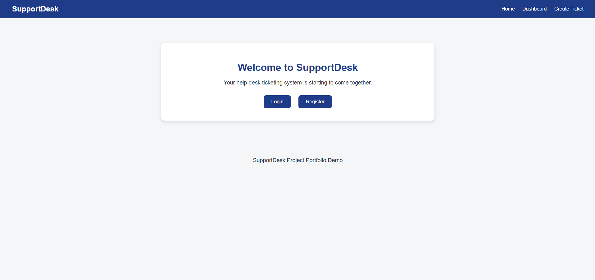
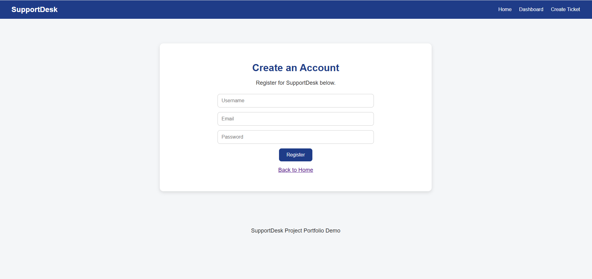
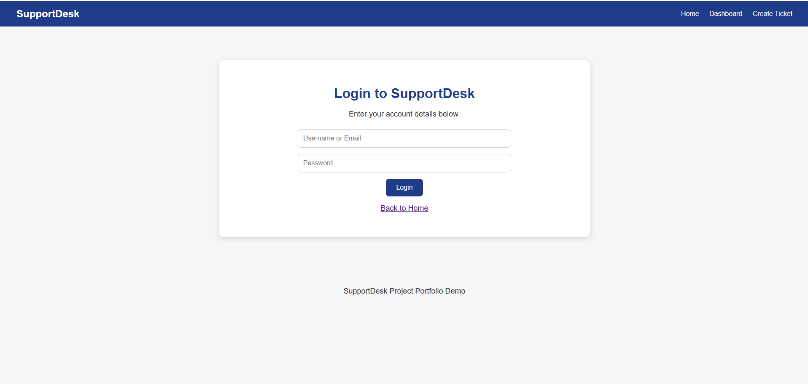
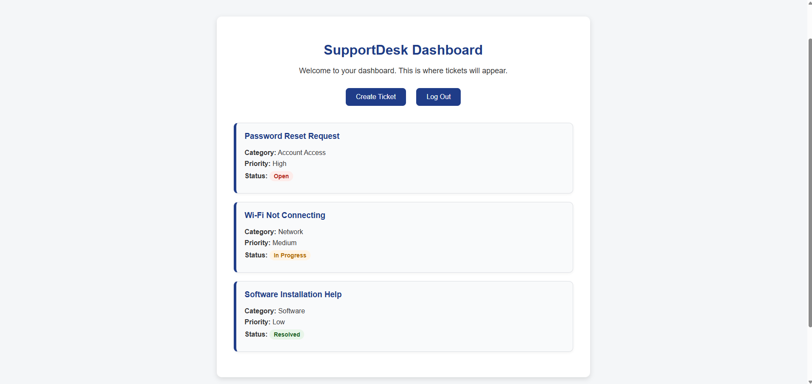
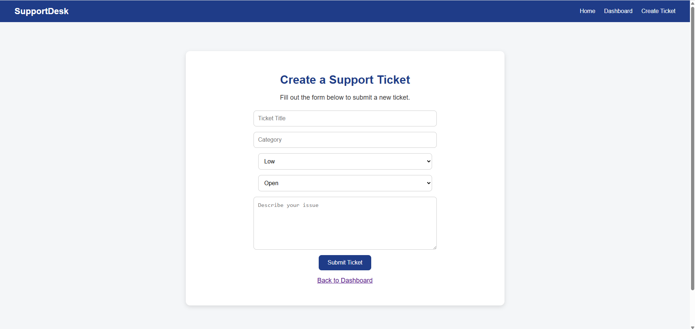

# SupportDesk

SupportDesk is a Flask-based help desk ticketing system project built for my software engineering portfolio.  
It allows users to navigate through a simple support workflow with login, registration, dashboard, and ticket creation pages.

## Features

- Home page with navigation
- Login page
- Register page
- Dashboard with sample support tickets
- Create Ticket form
- Status labels for Open, In Progress, and Resolved tickets
- Clean user interface with reusable Flask templates

## Tech Stack

- Python
- Flask
- HTML
- CSS

## Project Structure

supportdesk/
│
├── app.py
├── README.md
├── static/
│   └── style.css
└── templates/
    ├── base.html
    ├── index.html
    ├── login.html
    ├── register.html
    ├── dashboard.html
    └── create_ticket.html

## How to Run

1. Install Flask:
   pip install flask

2. Run the app:
   python app.py

3. Open in browser:
   http://127.0.0.1:5000

## Purpose

I built this project to strengthen my portfolio for entry-level software engineering opportunities by demonstrating:
- Flask routing
- reusable templates
- frontend styling
- basic help desk workflow design

## Future Improvements

- Add real authentication
- Store tickets in a database
- Allow users to submit and save real tickets
- Add ticket editing and status updates
- Add admin and user roles

## Screenshots

### Home Page

### Register Page

### Login Page

### Dashboard Page

### Create Ticket Page
